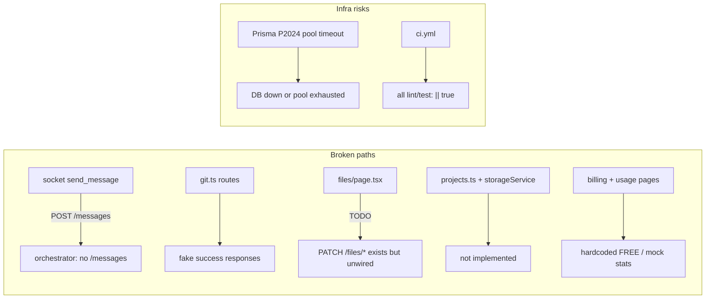
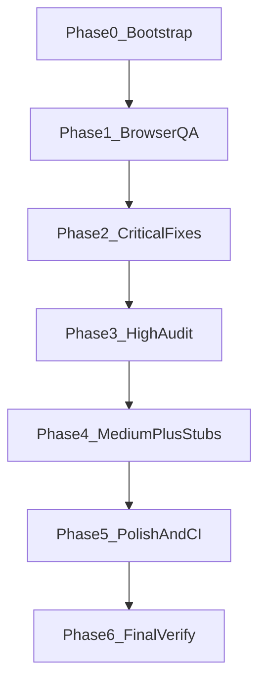

# SwarmDev Full Audit + Browser QA Fix Plan

## Current state (recon summary)

The monorepo has **three runnable apps** plus shared packages:

| Layer | Path | Port | Status |
|-------|------|------|--------|
| Frontend | [apps/web](apps/web) | 3000 | Next.js 14, Clerk-protected dashboard/IDE |
| API | [apps/api](apps/api) | 3001 | Express + Prisma + Socket.io |
| Orchestrator | [apps/orchestrator](apps/orchestrator) | 8000 | **Not started by `pnpm dev`** — must run manually |
| Infra | [infra/docker-compose.yml](infra/docker-compose.yml) | 5432/6379/6333 | Postgres, Redis, Qdrant |

**Already fixed since the audit doc was written** (skip or verify-only):
- Tasks 2–3: Orchestrator integration — [projectService.ts](apps/api/src/services/projectService.ts) calls `POST /projects/{id}/agents/start`; [main.py](apps/orchestrator/main.py) runs `_run_pipeline()` with full `initial_state`.
- Task 1: [security.py](apps/orchestrator/agents/security.py) no longer has hardcoded Mac paths.
- Task 4: [reviewer.py](apps/orchestrator/agents/reviewer.py) exists.
- REST chat: [chat.ts](apps/api/src/routes/chat.ts) correctly calls orchestrator `/chat` and emits `chat_message` via Socket.io.

**Confirmed still broken / stubbed:**

| Issue | File(s) |
|-------|---------|
| Socket forwards to dead `/messages` endpoint | [apps/api/src/socket/index.ts](apps/api/src/socket/index.ts) L64 |
| Git init/push/status/commit are stubs | [apps/api/src/routes/git.ts](apps/api/src/routes/git.ts) |
| File editor save not wired | [apps/web/src/app/project/[id]/files/page.tsx](apps/web/src/app/project/[id]/files/page.tsx) L95 |
| ZIP export unimplemented | [apps/api/src/routes/projects.ts](apps/api/src/routes/projects.ts), [storageService.ts](apps/api/src/services/storageService.ts) |
| Billing/usage hardcoded | [billing/page.tsx](apps/web/src/app/settings/billing/page.tsx), [usage/page.tsx](apps/web/src/app/settings/usage/page.tsx) |
| CI never fails on regressions | [.github/workflows/ci.yml](.github/workflows/ci.yml) L75–103 |
| Web tests orphaned (Vitest, no script) | [components.test.tsx](apps/web/src/__tests__/components.test.tsx) |
| Auth route tests permanently skipped | [routes.test.ts](apps/api/src/__tests__/routes.test.ts) L35 |

Past Playwright artifacts (`.playwright-mcp/`) show **historical** IDE crashes (`projectId`, `useChatStore`) that appear fixed in current [page.tsx](apps/web/src/app/project/[id]/page.tsx). Live browser QA is required to confirm.

---

## Phase 0 — Bootstrap and health baseline (~15 min)

**Goal:** All services reachable before any code changes.

1. **Verify infrastructure**
   - `cd infra && docker compose up -d` — confirm Postgres + Redis healthy
   - `cd packages/db && npx prisma generate && npx prisma migrate dev`
   - Confirm Ollama: `curl http://localhost:11434/api/tags`
   - Align secrets: `ORCHESTRATOR_SECRET` (API) = `API_SECRET` (orchestrator) = `dev-secret`

2. **Start all three apps safely**
   - `pnpm install` (root)
   - `pnpm dev` (web:3000 + api:3001)
   - `cd apps/orchestrator && python main.py` (port 8000, separate terminal)
   - `pnpm dev:check:strict` — catches the “blank/unstyled UI” manifest bug ([scripts/health-check.sh](scripts/health-check.sh))

3. **Env reconciliation** (user said infra is “not sure”)
   - Validate [apps/web/.env.local](apps/web/.env.local): `NEXT_PUBLIC_SOCKET_URL=http://localhost:3001`
   - Validate [apps/api/.env](apps/api/.env): `DATABASE_URL`, `REDIS_URL`, Clerk keys, `ORCHESTRATOR_URL`
   - If API `/health` or Prisma calls fail → fix DB connectivity before proceeding

4. **Audit reconciliation checklist** — mark each of Tasks 1–13 done/partial/broken before editing (prevents re-implementing fixed work).

---

## Phase 1 — Browser QA discovery (~30 min)

Follow gstack **/qa** methodology using the browse binary (`$B`):

| Route | What to verify |
|-------|----------------|
| `/` | Landing loads, styles present |
| `/dashboard` | Clerk auth, project list, Swarm capacity widget, create project |
| `/project/[id]` | IDE layout, editor tabs, chat sidebar, terminal, agent panel |
| `/project/[id]/files` | File tree, editor, **save** |
| `/project/[id]/chat` | Full ChatWindow, model/agent selectors |
| `/settings`, `/settings/billing`, `/settings/usage` | Real vs mock data |
| Delete project flow | Confirm dialog → list updates |

**Capture per page:** console errors, network 4xx/5xx, broken Socket.io connection, missing CSS.

**Auth:** Use Clerk sign-in (user confirmed Clerk is configured). If blocked, run `/setup-browser-cookies` or manual cookie import per gstack browse skill.

---

## Phase 2 — Critical runtime fixes (Tasks 1–5 + live browser blockers)

Execute in dependency order; **one bisected commit per logical fix**.

### 2a. Socket chat path (Task 10 subset + Task 27)
- **Fix:** In [socket/index.ts](apps/api/src/socket/index.ts), change `send_message` handler to mirror [chat.ts](apps/api/src/routes/chat.ts): call `ORCHESTRATOR_URL/chat` with `X-API-SECRET`, persist agent response, emit `chat_message` (not just `agent_message`).
- **Alternative:** Deprecate `send_message` socket event entirely if frontend only uses REST `/chat` (verify via grep + browser network tab).
- **Verify:** Send chat message in IDE sidebar; agent response appears without page refresh.

### 2b. File save (frontend TODO)
- **Fix:** Wire [files/page.tsx](apps/web/src/app/project/[id]/files/page.tsx) `onChange`/save to existing `PATCH /api/projects/:id/files/*` in [files.ts](apps/api/src/routes/files.ts).
- **Verify:** Edit file → save → reload → content persists.

### 2c. Prisma pool / DB errors
- If P2024 reproduces: tune `connection_limit` in `DATABASE_URL`, ensure background R2 sync doesn't exhaust pool ([syncService.ts](apps/api/src/services/syncService.ts)), add graceful retry on connection closed.

### 2d. Re-verify audit Tasks 1–5
- Task 1: Run security agent import test
- Tasks 2–3: Create project → confirm orchestrator receives context → agents run
- Task 5: Confirm generated files land in `ProjectFile` via orchestrator `_save_files_to_api`

---

## Phase 3 — High priority audit (Tasks 6–13)

| Task | Action | Key files |
|------|--------|-----------|
| 6 Redis/BullMQ queue | Evaluate if needed now; orchestrator already uses `BackgroundTasks`. Implement BullMQ worker only if concurrent job limits are hit. | [projectService.ts](apps/api/src/services/projectService.ts), new `worker.py` |
| 7 Redis pub/sub | Verify [socket/index.ts](apps/api/src/socket/index.ts) subscriber + [socket_emitter.py](apps/orchestrator/utils/socket_emitter.py) bridge; fix if events don't reach frontend | both |
| 8 Plan enforcement | Wire [planCheck.ts](apps/api/src/middleware/planCheck.ts) + [checkPlan.ts](apps/api/src/middleware/checkPlan.ts) to block project creation when over FREE limit (3); surface UI error on dashboard | middleware + [dashboard/page.tsx](apps/web/src/app/dashboard/page.tsx) |
| 9 Rate limits | Confirm [index.ts](apps/api/src/index.ts) middleware order; separate auth/project limiters | [apps/api/src/index.ts](apps/api/src/index.ts) |
| 10 Socket handlers | Complete `request_file`, `exec_command` (terminal), fix `send_message` | [socket/index.ts](apps/api/src/socket/index.ts) |
| 11 Clerk webhook | Verify [webhooks route](apps/api/src/routes/) exists and syncs users | API routes |
| 12 R2 sync | Fix bucket name drift (`swarmdev` vs `swarmdev-files`); ensure sync doesn't crash API | [storageService.ts](apps/api/src/services/storageService.ts), [syncService.ts](apps/api/src/services/syncService.ts) |
| 13 Graph workflow | Align [graph.py](apps/orchestrator/graph/graph.py) DAG with blueprint | orchestrator |

---

## Phase 4 — Medium priority (Tasks 14–18)

- **Task 14:** Settings/billing/usage pages — replace mocks with `/api/user/profile` + usage endpoints (or create minimal usage API from `UsageLog` Prisma model).
- **Task 15:** Extract shared components (`ProjectCard`, `AgentCard`) from duplicated dashboard/IDE markup.
- **Task 16:** Qdrant RAG — replace hash placeholders in [base.py](apps/orchestrator/agents/base.py) with real embeddings (optional if Ollama embeddings available).
- **Task 17:** [agentService.ts](apps/web/src/services/agentService.ts) already exists — ensure all agent UI paths use it consistently.
- **Task 18:** Agent-to-agent messaging via `query_agent` in [base.py](apps/orchestrator/agents/base.py) — verify supervisor uses it.

**Additional stubs from codebase scan (not numbered in audit but user-requested):**
- **Git routes:** Implement via [sandboxService.ts](apps/api/src/services/sandboxService.ts) E2B exec (`git init`, `status`, `commit`, `push`) in [git.ts](apps/api/src/routes/git.ts).
- **ZIP export:** Stream `ProjectFile` records into archiver in [projects.ts](apps/api/src/routes/projects.ts).

---

## Phase 5 — Quality and polish (Tasks 19–30)

| Task | Action |
|------|--------|
| 19 | API Dockerfile production build |
| 20 | Update Stripe API version |
| 21 | SecurityAgent event name fix |
| 22–23 | Prompts/tools directory structure |
| 24 | Add web `test` script + vitest; un-skip API auth tests with test DB; add `pytest-asyncio` to requirements |
| 25 | Remove stale directories |
| 26 | BullMQ worker (if Task 6 deferred) |
| 27 | ChatStore real-time — covered in Phase 2 |
| 28–29 | Clean shared-packages / config.yaml |
| 30 | Verify all middleware modules wired in [index.ts](apps/api/src/index.ts) |

**CI hardening (cross-cutting):** Remove `|| true` from [.github/workflows/ci.yml](.github/workflows/ci.yml) lint/test steps so regressions block merge.

---

## Phase 6 — Final verification

1. `pnpm dev:check:strict` — CSS + API health
2. `pnpm lint` + `pnpm test` (after Task 24 fixes)
3. `cd apps/orchestrator && pytest -q`
4. **Browser re-QA** — full route matrix from Phase 1; zero console errors on critical paths
5. End-to-end smoke: landing → sign in → create project → agents run → files appear → chat responds → terminal executes → delete project

---

## Execution order (recommended)

**Commit discipline:** Bisect commits per task (e.g., "fix: socket send_message uses orchestrator /chat", "feat: wire file save to PATCH endpoint"). No `git add .` (gstack binaries in `browse/dist/` are tracked by mistake).

**Estimated effort (CC+gstack):** ~2–4 hours for Phases 0–2; full 30-task audit ~1–2 days.
